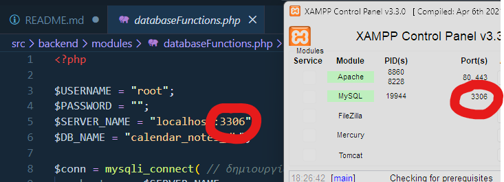

# Εγκατάσταση

1. Πρέπει να υπάρχει εγκατεστημένος XAMPP Server με MySQL με username "root" και κενό κωδικό, επειδή τα login credentials είναι hardcoded.

2. Δημιούργησε μια κενή βάση δεδομένων μέσω phpMyAdmin με όνομα "`calendar_notes_db`".

3. Κατεβάσε τον πηγαίο κώδικα με μορφή zip (ή git clone) και κάνε extract 
μέσα στο htdocs του XAMPP. 

4. Έπειτα, σε εναν browser με τον XAMPP server να τρέχει με Apache και MySQL, πήγαινε στο `localhost/[όνομα του φακέλου]`. 
Για παράδειγμα: `http://localhost/php-b-tetramino-project-lykeio2026`

5. Εάν δείξει error ότι "`Connection failed: No connection could be made because the target machine actively refused it`":
    
    * πήγαινε στο άρχειο `databaseFunctions.php` στο `src/backend/modules` , και σιγουρέψου ότι αυτά τα δυο κυκλωμένα νούμερα είναι τα ίδια:
    

